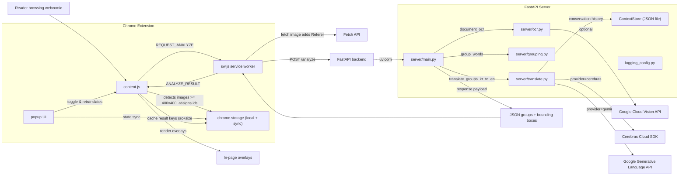

# Comic Buddy Technology Map

## System Flow
1. The reader loads a webcomic page; `content.js` watches for large images, tags each candidate with an id, and looks up cached results in `chrome.storage`.
2. When a new panel needs translation, `content.js` sends a `REQUEST_ANALYZE` message to the service worker, which fetches the image bytes (preserving the referer when required) and posts them to the FastAPI `/analyze` endpoint.
3. The FastAPI app (`server/main.py`) runs OCR, clusters word polygons, and invokes the translator adapter (Cerebras, Gemini, or the echo fallback). It writes the translated groups into the JSON response and records context for future consistency.
4. The service worker returns the `ANALYZE_RESULT` to `content.js`, which caches the payload, scales bounding boxes to the page, and renders overlays. The popup UI reads the same shared state to toggle the translator and trigger retranslations.
5. Subsequent visits reuse cached translations until the user forces a refresh, keeping the UI responsive even when APIs are unavailable.
